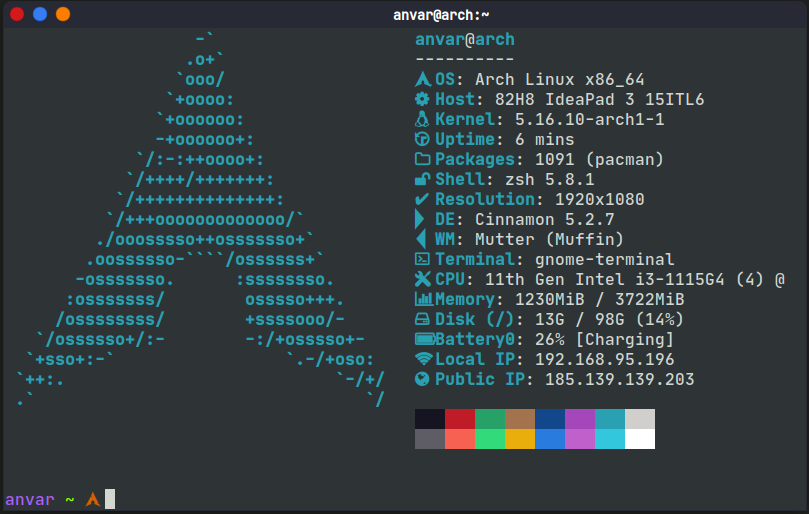

# dotfiles
linux configlarim



`zsh` va `neofetch` uchun configlar

foydalanish:

```
git clone https://github.com/anvar-alimov/dotfiles.git/
cd ./dotfiles
cp -r .zshrc ~/
cp -r .p10k.zsh ~/
cp -r .zshrc.pre-oh-my-zsh ~/
cp -r .oh-my-zsh ~/
cp -r ./config/neofetch ~/.config/neofetch

```

# agar nerd font o'rnatilmagan bo'lsa:

```
[xinux]
SigLevel = Optional TrustedOnly
Server=https://mirror.xinux.uz/$arch

```

shu sozlamalarni `/etc/pacman.conf`'ga qo'shing va `sudo pacman -Sy` buyrug'i bilan reponi yangilang:

```

sudo pacman -Sy nerd-fonts-jetbrains-mono

```

Tizim sozlamalaridan shriftni `JetBrainsMonoMedium Nerd Font` qilib o'zgarting va configlarni o'rnating


&copy 2022 Anvar Ali